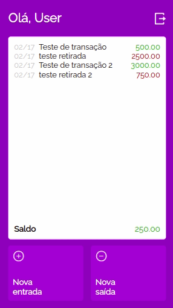

# MyWallet

<p align="center">

</p>

A virtual wallet app written in React that allows you stay aware of your financial transactions!

Try it now [here](https://mywallet-chi.vercel.app)

## About

Below are the implemented features on this App:

- Sign Up
- Login
- List of your transactions by date and actual balance.
- Button to add new Transactions.

Below are the not yet implemented features on this App:

- Delete transactions.
- Change Description transactions.

By using this App, the Client can take a look on her/his financial transactions and has a financial controll to self remember.

## Technologies
The following tools and frameworks were used in the construction of the project:<br>
<p>
  
  
  
  
  
</p>

## How to run


First of all, follow the instructions to [run BackEnd repository click here](https://github.com/C137Rodrigolima/MyWallet_BackEnd)


1. Clone this repository.
2. Create a new archive named `.env` in the project folder and put on it
```
REACT_APP_API_BASE_URL=http://localhost:5000
```
4. Install dependencies
```bash
npm i
```
5. Run the front-end with
```bash
npm start
```
6. You can optionally build the project running
```bash
npm run build
```
7. Finally access http://localhost:3000 on your favorite browser.
8. Test It by yourself...